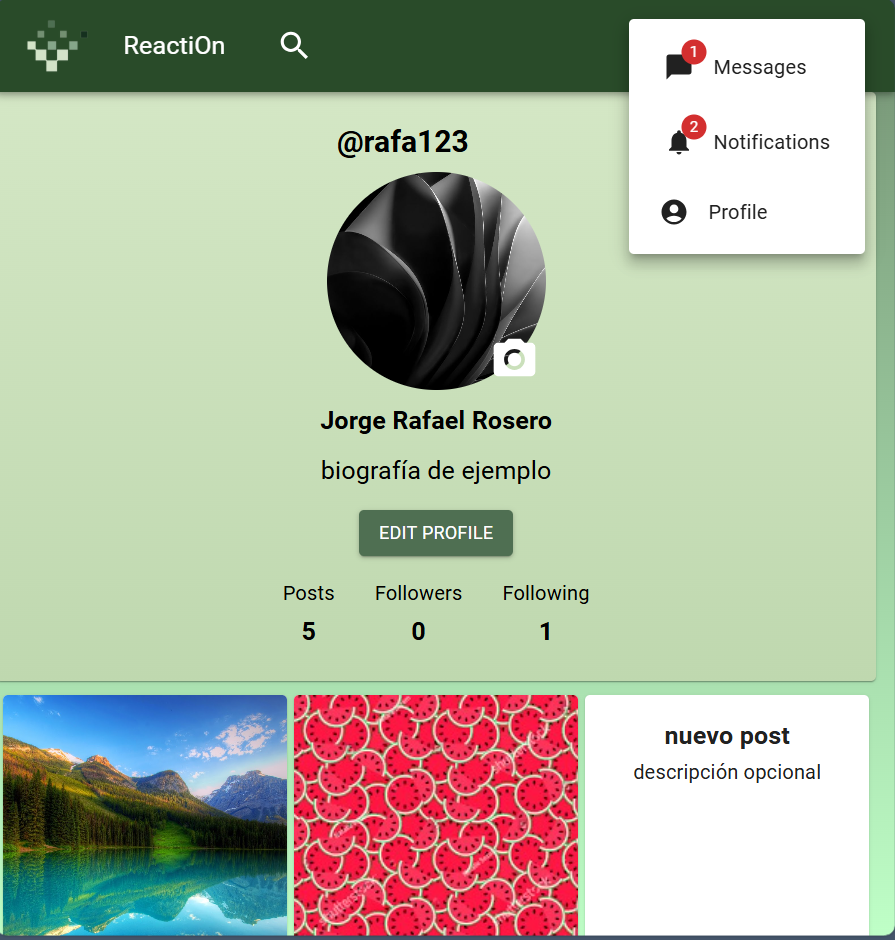
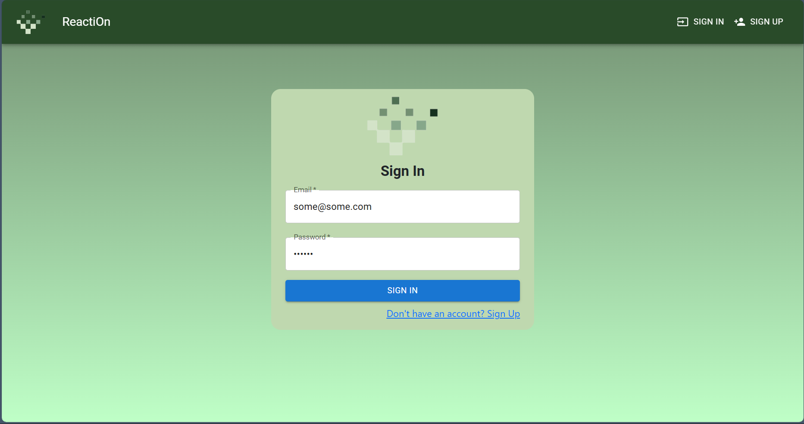

# 🌐 ReactiOn - MERN Stack Social Network


A full-featured social media platform built with the MERN stack (MongoDB, Express.js, React.js, Node.js). ReactiOn provides real-time messaging, dynamic posts feed, user interactions, and comprehensive notification system.

## ✨ Features

### 📝 Posts & Feed
- Create posts with text, images, and GIFs
- Dynamic and interactive feed
- Like and comment on posts
- Real-time post updates
- Share functionality


### 💬 Real-Time Chat
- Instant messaging with Socket.IO
- One-on-one conversations
- Message notifications
- Online status indicators
- Message history


### 👥 Social Features
- Follow/Unfollow users
- User profiles with bio and stats
- Profile picture and cover photo
- View followers and following lists
- User search functionality




### 🔔 Notification System
- Real-time push notifications
- Notifications for:
  - New likes on posts
  - New comments
  - New followers
  - New messages
- Mark all as read functionality
- Delete notifications option


### 🔐 Authentication & Security
- Secure JWT authentication
- Password hashing with bcrypt
- Protected routes
- Form validation
- Session management




### 📱 Responsive Design
- Fully responsive layout
- Mobile-optimized interface
- Adaptive navigation
- Touch-friendly interactions


## 🛠️ Tech Stack

### Frontend
- **React.js** - UI library
- **Material-UI** - React component library
- **Bootstrap** - CSS framework
- **React Router** - Navigation
- **Context API** - State management
- **Axios** - HTTP client
- **Socket.IO Client** - Real-time communication

### Backend
- **Node.js** - Runtime environment
- **Express.js** - Web framework
- **MongoDB** - NoSQL database
- **Mongoose** - MongoDB ODM
- **Socket.IO** - WebSocket server for real-time features
- **JWT** - JSON Web Token authentication
- **Bcrypt** - Password hashing
- **Cloudinary** - Cloud-based media storage and management

## 📂 Project Structure
```
REACTION-APP/
├── client/              # React frontend
│   ├── src/
│   │   ├── components/  # React components
│   │   ├── context/     # Context providers
│   │   ├── pages/       # Page components
│   │   ├── utils/       # Utility functions
│   │   └── assets/      # Images and static files
│   └── package.json
│
├── server/              # Express backend
│   ├── controllers/     # Route controllers
│   ├── models/          # MongoDB models
│   ├── routes/          # API routes
│   ├── middleware/      # Custom middleware
│   ├── config/          # Configuration files
│   └── package.json
│
├── upload/              # Temporary upload directory
└── docs/                # Documentation and images
    └── images/          # Screenshot images
```

## 🚀 Getting Started

### Prerequisites
- Node.js (v14 or higher)
- MongoDB (local or Atlas)
- npm or yarn
- Cloudinary account (for media storage)

### Installation

1. **Clone the repository**
```bash
git clone https://github.com/DevJorgeRafael/Reaction-App.git
cd Reaction-App
```

2. **Install server dependencies**
```bash
cd server
npm install
```

3. **Install client dependencies**
```bash
cd ../client
npm install
```

4. **Configure environment variables**

Create a `.env` file in the `server` directory:
```env
PORT=5000
MONGO_URI=your_mongodb_connection_string
JWT_SECRET=your_jwt_secret_key
CLOUDINARY_CLOUD_NAME=your_cloudinary_cloud_name
CLOUDINARY_API_KEY=your_cloudinary_api_key
CLOUDINARY_API_SECRET=your_cloudinary_api_secret
```

Create a `.env` file in the `client` directory:
```env
REACT_APP_API_URL=http://localhost:5000
```

5. **Run the application**

Start the backend server:
```bash
cd server
npm start
```

Start the frontend (in a new terminal):
```bash
cd client
npm start
```

The application will be available at `http://localhost:3000`

## 📸 More Screenshots

### Navigation & Interface


### Post Management


## 🌟 Key Features Implementation

### Real-Time Communication
ReactiOn uses Socket.IO for bidirectional event-based communication:
- Instant message delivery
- Live notification updates
- Online presence detection
- Real-time feed updates

### Media Management
Integration with Cloudinary for efficient media handling:
- Image optimization and compression
- Automatic format conversion
- Responsive image delivery
- Secure CDN distribution
- GIF support

### State Management
Context API for global state management:
- User authentication state
- Notification state
- Socket connection management
- User preferences

### UI/UX Design
Built with Material-UI and Bootstrap:
- Consistent design language
- Pre-built responsive components
- Customizable theme system
- Smooth animations and transitions
- Accessibility features

## 🤝 Contributing

Contributions are welcome! Please feel free to submit a Pull Request.

1. Fork the project
2. Create your feature branch (`git checkout -b feature/AmazingFeature`)
3. Commit your changes (`git commit -m 'Add some AmazingFeature'`)
4. Push to the branch (`git push origin feature/AmazingFeature`)
5. Open a Pull Request

## 📝 License

This project is open source and available under the [MIT License](LICENSE).

## 👤 Author

**Jorge Rafael Rosero**

- GitHub: [@DevJorgeRafael](https://github.com/DevJorgeRafael)

## 🙏 Acknowledgments

- Material-UI and Bootstrap teams for excellent UI components
- Socket.IO documentation and community
- Cloudinary for media management solutions
- MERN stack community tutorials and resources

---

⭐ Star this repository if you find it helpful!

📧 For questions or feedback, please open an issue.